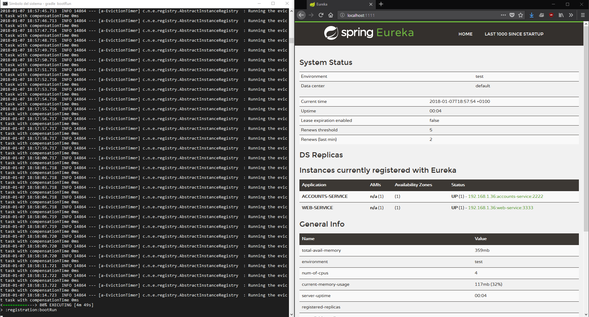

**1. The two microservices are running and registered**

Below we can find the console logs and the dashboards of accounts and web, in that order.

**2. The service registration service has the two microservices registered**

Below we can find the console log and the dashboard of registration, which contains both services registered.

**3. A second account microservice is running in the port 4444 and it is registered**

By changing the port in the configuration file _application.yml_ to 4444 and running it again in a new console, 
we can finally demonstrate that the service is running and registered.

**4. A brief report describing what happens when you kill the microservice with port 2222.**

When you kill the microservice with port 2222, the web service switches the service provider. 

**Can the web service provide information about the accounts?**

It can provide information correctly.

**Why?**

When the web asks the registration service for the Accounts service, 
it returns the one running under port 2222.
But when the web tries to reach it, it realizes that it's down, 
so it asks the registration service again, 
which will return the service running under port 4444. 
The web service then tries to reach port 4444 and
begins working correctly.